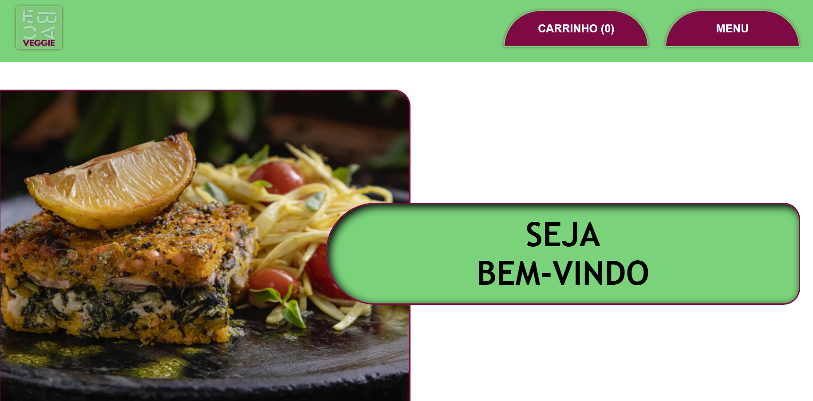
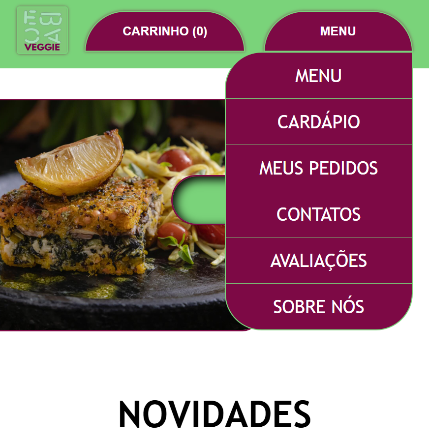

# 👩‍💻MEU PRIMEIRO PROJETO DE PORTFÓLIO👩‍💻

# 🥗 EBAC Veggie - Restaurante Vegano

**EBAC Veggie** é um site de um restaurante vegano fictício, desenvolvida como parte do meu portfólio de desenvolvimento web e design. O projeto foi baseado em uma interface original de UI/UX criada por mim durante uma Jornada realizada pela EBAC - Escola Britânica de Artes Criativas & Tecnologia, com foco em estética moderna, responsividade e navegação clara.

---

## 🎨 Design UI/UX Original

O layout e a identidade visual do site foram criados previamente em um projeto de UI/UX. Você pode visualizar o case com o protótipo completo no link abaixo:

👉 [Ver Case no Google Drive](https://drive.google.com/file/d/1KGIS4aKZ9wo_2JXhhz_KYLWZ9b5xOnBl/view?usp=drive_link)

O Case contém:
- A Matriz CSD
- Desk Research
- Pesquisas com personas e pessoas reais
- Protótipo de Baixa e Alta qualidade
- E dentre outros!\
**🔍 Dar uma conferida lá!**

---

## 🚀 Deploy
[🌐 Deploy do Site](https://ebac-veggie.vercel.app/)

---

## 🛠 Tecnologias utilizadas

- HTML5
- CSS3
- JavaScript
- Supabase
- Git e GitHub

---

## ✨ Funcionalidades

- [x] Layout responsivo baseado em design próprio (UI/UX autoral)
- [x] Página inicial com chamada visual
- [ ] Cardápio em construção...
- [ ] Pedidos em construção...
- [ ] Avaliações em construção...
- [x] Menu completo e responsivo.
- [x] Várias páginas como contatos, sobre e etc.
- [x] Site feito para todos os dispositivos.

---

## 📸 Capturas de tela

 
 
 **SITE DESKTOP:** 

---

 
 **SITE MOBILE**
 

 

# 🙏 OBRIGADO PELA VISITA!
